# Tree Forum — ASP.NET Web Forum Application

Tree Forum is a full-stack web forum built with **C# and ASP.NET Core**, featuring user authentication, role-based access control, and persistent data storage using a relational SQL database. The project demonstrates core web application concepts including authentication, authorization, CRUD operations, and server-side rendering with Razor Pages.

---

## 📌 Project Overview

Tree Forum allows users to create discussion threads, comment on posts, and manage personal profiles within a secure, authenticated environment. The system enforces ownership-based access control, ensuring users can only modify their own content.

This project was built to demonstrate:
- Secure user authentication and authorization
- Relational data modeling for forum-style applications
- Full CRUD workflows with access restrictions
- Server-rendered UI using Razor Pages

---

## ✨ Features

- User registration and login using ASP.NET Identity  
- Create, edit, and delete discussion threads (owner-only)  
- Commenting system with user attribution  
- Public thread browsing for unauthenticated users  
- User profile pages displaying account details and authored threads  
- User account management (profile updates, avatar upload)  
- Dynamic navigation based on authentication state  

---

## 🛠️ Technology Stack

### Backend
- C# / ASP.NET Core  
- Razor Pages  
- ASP.NET Identity  
- Entity Framework Core  
- SQL Database  

### Frontend
- Razor Views  
- Server-side rendered HTML  
- CSS  

---

## 🔐 Authentication & Authorization

- Authentication handled via ASP.NET Identity  
- Authorization rules enforce:
  - Only authenticated users can create posts or comments
  - Users may edit or delete only their own discussions
  - Private pages (e.g., **My Threads**) are inaccessible to other users
- User data is securely persisted in a relational database

---

## 📸 Screenshots

### Public Forum (Unauthenticated User)
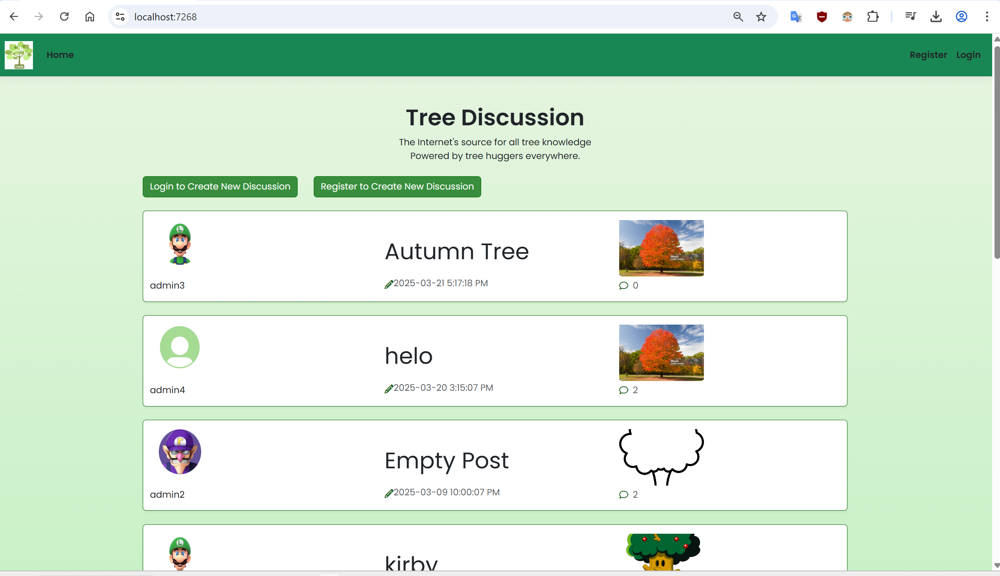

---

### Thread Discussion and Comments
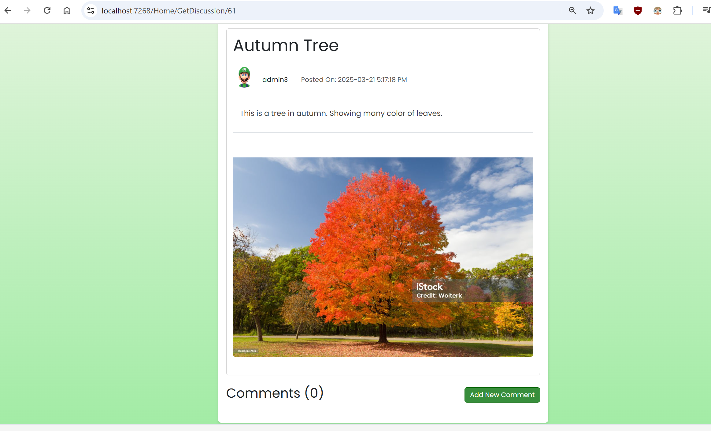  
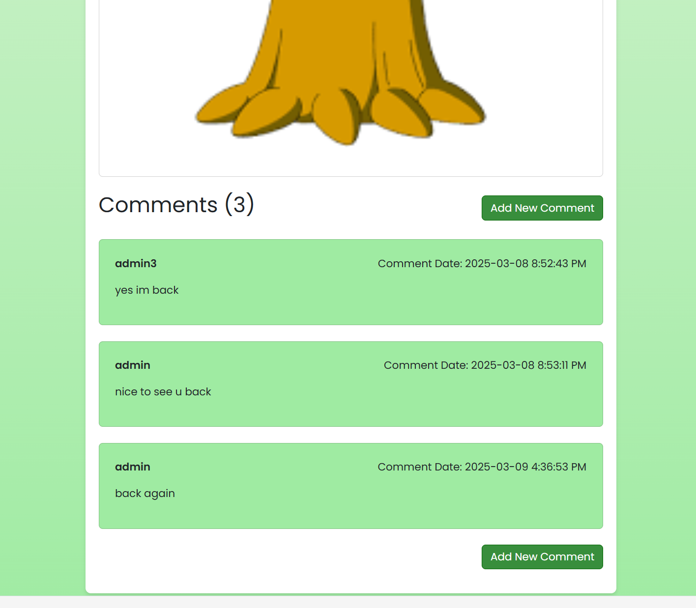

---

### Authentication
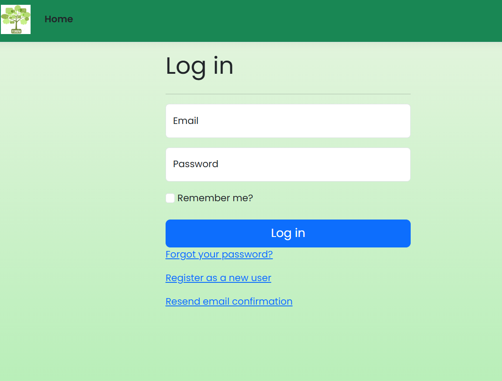  
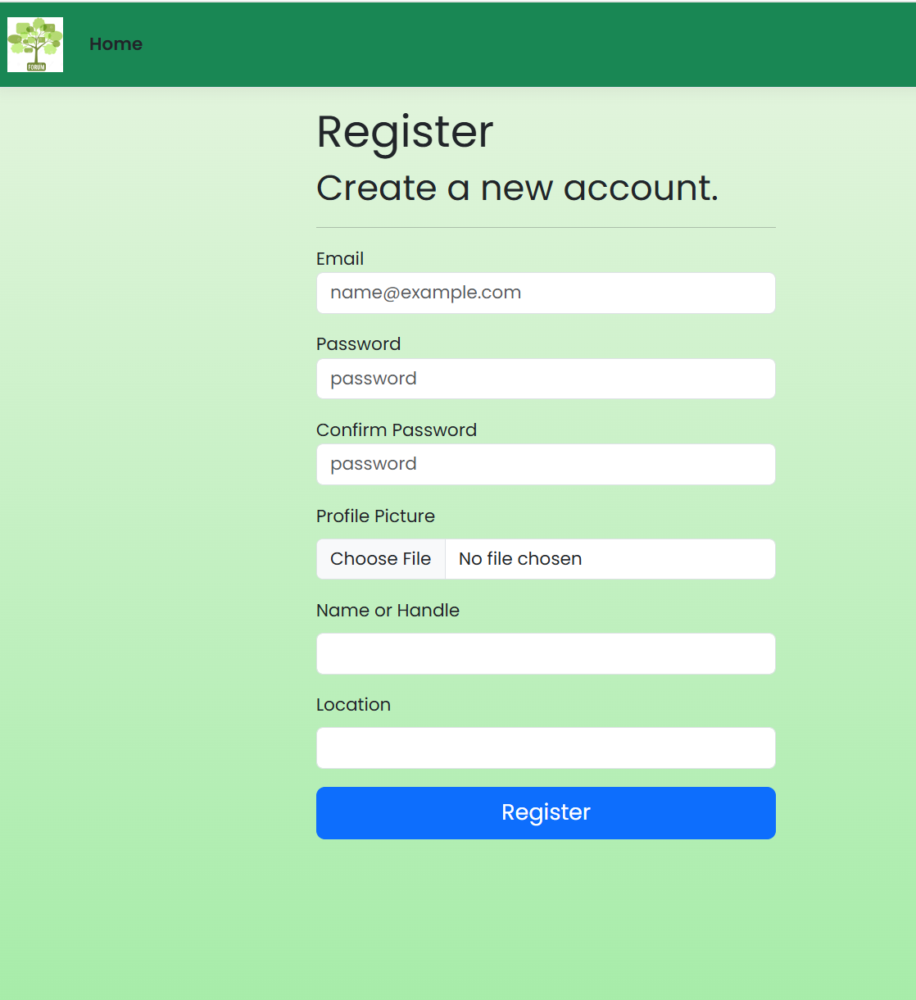

---

### Authenticated User Experience
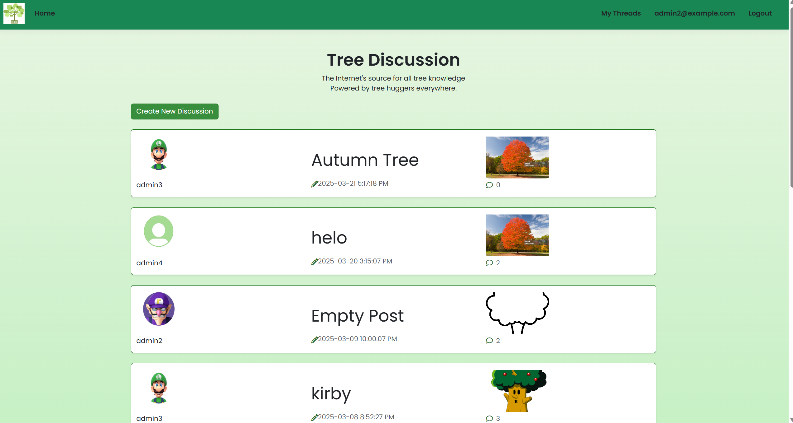  
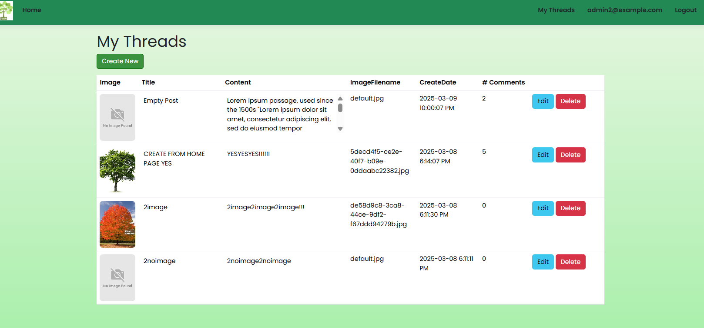

---

### User Profile & Management
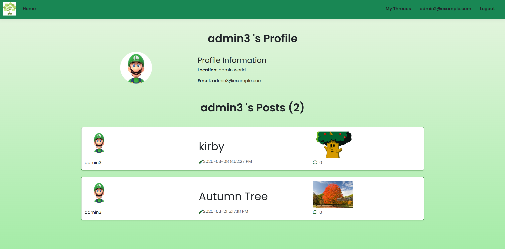  
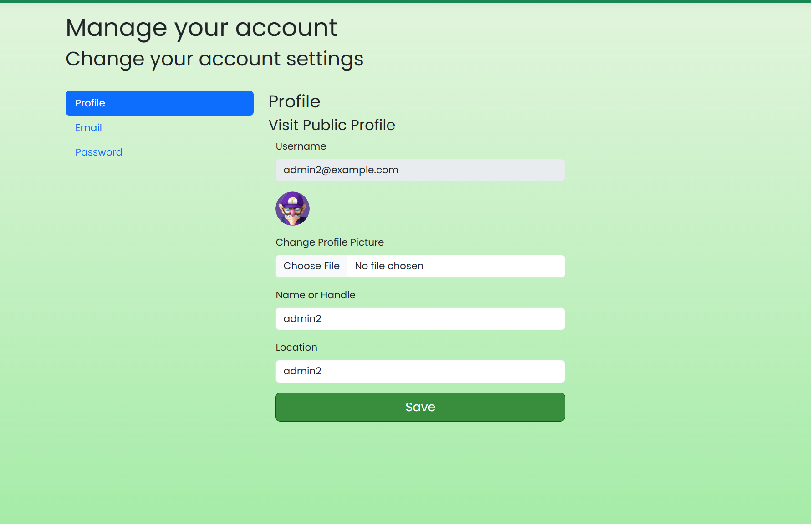  
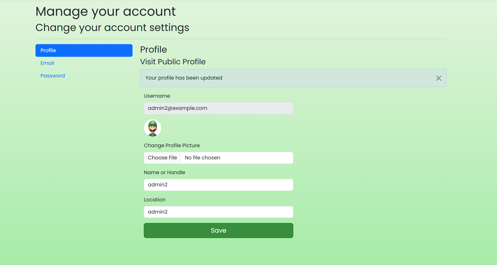

---

### Content Management
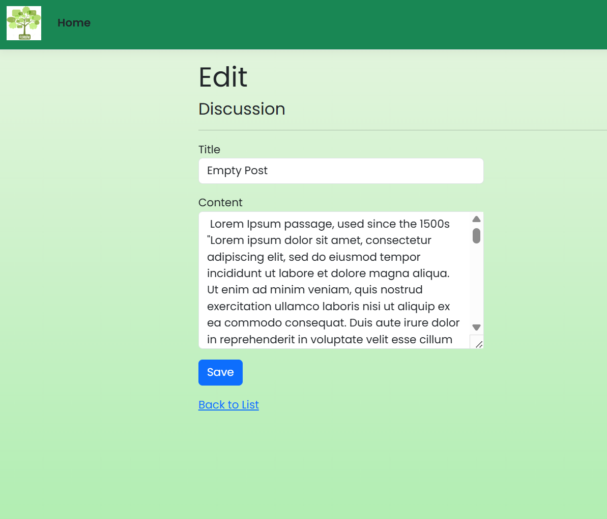  
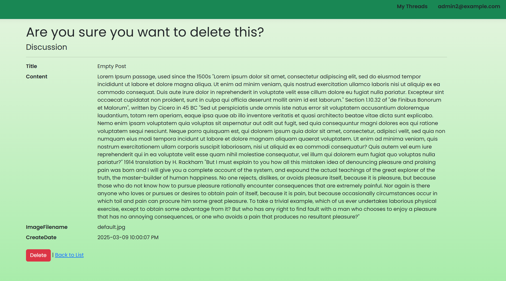

---

## 📚 What This Project Demonstrates

- Full-stack web development with ASP.NET Core  
- Secure authentication and authorization workflows  
- Relational database design with Entity Framework  
- Server-side rendering using Razor Pages  
- Ownership-based access control for user-generated content  

---

## 🚀 Future Improvements

- Pagination for large discussion lists  
- Search and filtering functionality  
- Role-based moderation tools  
- REST API layer for a future SPA frontend  

---
